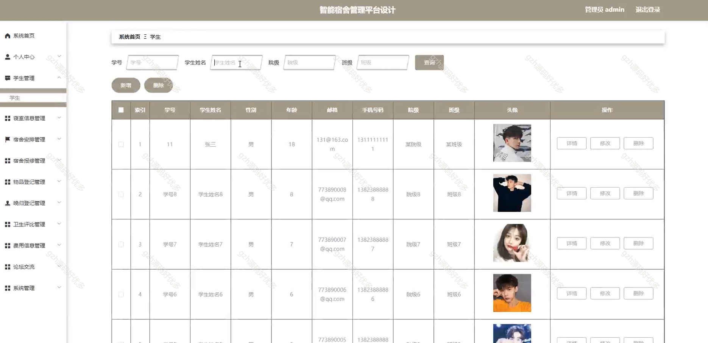

# python011
python011基于Django的宿舍管理系统
 
## 查看主页获取源码

### 一、关键词

宿舍管理系统、宿管、宿舍报修

 

### 二、作品包含

源码+数据库+设计文档万字+PPT+全套环境和工具资源+部署教程

 

### 三、项目技术

前端技术：Html、Css、Js、Vue2.0、Element-ui
后端技术：Python3.7、Django2.0

  

 

### 四、运行环境（以下版本亲测，其他版本未知，请自测）

开发工具：PyCharm + VSCODE

数据库：MySQL5.7（最低要5.7版本）

数据库管理工具：Navicat10+

Python：Python3.7

前端Nodejs：14

浏览器：谷歌浏览器

 

### 五、项目介绍

项目编号：python011

本文首先实现了智能宿舍管理平台设计技术的发展随后依照传统的软件开发流程，最先为系统挑选适用的言语和软件开发平台

该智能宿舍管理平台，前台供学生浏览寝室信息、参与论坛交流等，设有个人中心；管理员可全面管理学生、寝室、宿舍安排、报修、物品登记等各类事务，学生也能在系统中处理个人及宿舍相关操作 。

 

### 六、运行截图

